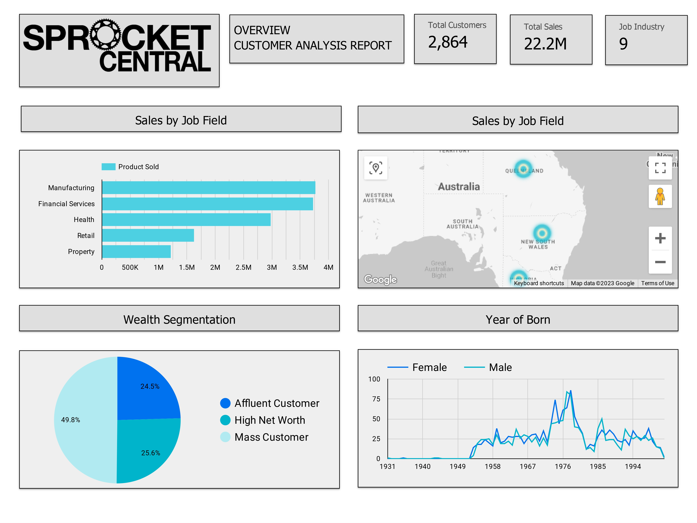

# Retail Store Targeted Sales Dashboard

Unlock the power of data as we delve into key insights that shape success. This exploration reveals not just numbers, but actionable strategies to harness untapped potential.

**Peering into the Insights:**
From a gender-based profit split to customer segmentation's impact, we unveil a data-driven narrative. The journey unfolds as we explore regional dynamics, age groups, and industries that make the gears of profit turn.

**Charting a Visual Odyssey:**
The culmination of these revelations takes form in a captivating dashboard. It's not just data; it's a visual journey that encapsulates the essence of insights, ready to empower your next decisions.

*But it doesn't stop there...*

**Guiding the Path Ahead:**
We're not just handing over data; we're presenting a roadmap. The dashboard becomes a compass, pointing to the demographics of potential high-value customers. It's not just what's happened; it's about steering what's yet to unfold.

## Data Visualization & Dashboard:

The insights come to life through visuals, as a dashboard showcases the story behind the numbers. It's not just about graphs; it's about illuminating paths that lead to informed strategies.

*Now, a Glimpse into the Dashboard:*

## Recommendations:

**A Tale of Strategy:**
These insights are more than dots on a chart; they're actionable strategy components. Demographics hold the key to high-value customers, the very heart of successful campaigns. This is your guide to shaping marketing efforts, directing ads, and crafting campaigns that resonate where it matters most.

*In a Nutshell:*
This journey isn't just about data; it's about crafting success stories. Empowered by insights, your decisions will be guided by the stories these numbers tell. Welcome to the realm where data ignites transformation.

For a visual representation of this project, check out the Google Looker Studio link : [Link Dashboard](https://lookerstudio.google.com/reporting/624a3bdb-947e-4933-adb1-fec14d0bf6a9) 📊.
